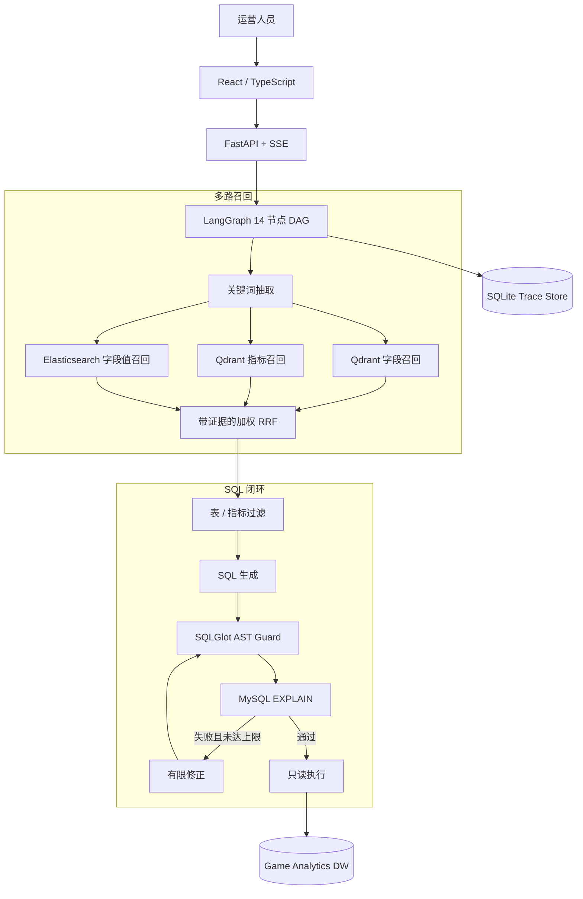
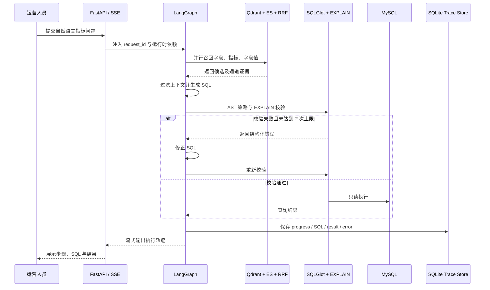
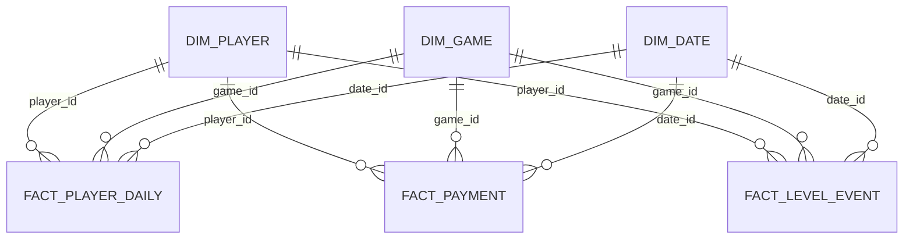

<div align="center">

# GameQuery · 游戏运营 Text-to-SQL Agent

**把自然语言运营问题转换为可追踪、可修正、受安全策略约束的 SQL**

14 节点 DAG · 指标语义层 · 混合检索 · SQL AST 护栏 · 有限纠错 · 轨迹回放 · SSE

[](https://www.python.org/)
[](https://fastapi.tiangolo.com/)
[](https://react.dev/)
[](https://github.com/youcaifang66-ops/gamequery-agent/actions/workflows/ci.yml)
[](LICENSE)

</div>

---

## 项目简介

GameQuery 面向游戏运营分析，将日活、在线时长、收入、付费人数、ARPU 和关卡通过率等自然语言问题转换为 SQL。系统使用 LangGraph 编排关键词抽取、字段/指标/字段值召回、上下文过滤、SQL 生成、AST 校验、有限纠错和只读执行，并通过 SSE 返回完整步骤轨迹。

项目使用仓库内自建的模拟游戏运营数仓，适合验证 Agent 编排、Schema Linking、SQL 安全和失败恢复，不冒充真实企业业务数据。

### 适用场景

- 👥 **活跃分析**：查询 DAU、活跃天数和玩家在线时长
- 💰 **付费分析**：统计 Revenue、付费人数和 ARPU
- 🎮 **游戏拆分**：按游戏、日期、渠道等维度聚合指标
- 🧩 **关卡分析**：统计尝试次数、通关数和关卡通过率
- 🔍 **研发审计**：回放 SQL 生成、校验、修正和执行轨迹

---

## 系统架构



### 核心流程



---

## 核心功能

### 1. 指标语义层

系统不把指标口径完全交给模型自由推断，而是在 `conf/metrics.yaml` 中显式维护公式、别名、粒度、时间字段和依赖表。

| 指标 | 公式摘要 | 粒度 | 主数据表 |
|---|---|---|---|
| DAU | 活跃玩家去重计数 | 日 | `fact_player_daily` |
| Revenue | 付费金额求和 | 日 | `fact_payment` |
| PayerCount | 付费玩家去重计数 | 日 | `fact_payment` |
| ARPU | 收入 / 活跃玩家数 | 日 | 支付表 + 日活表 |
| LevelPassRate | 通关次数 / 尝试次数 | 关卡 | `fact_level_event` |

### 2. 14 节点 Agent 编排

```text
关键词抽取
  ├─ 字段召回 ─┐
  ├─ 指标召回 ─┼─ 信息合并 ─┬─ 表过滤 ─┐
  └─ 字段值召回 ┘           └─ 指标过滤 ─┤
                                  信息完整性检查
                                  ├─ 不完整 → 澄清
                                  └─ 完整 → SQL 生成
                                         ↓
                                  校验 ⇄ 有限修正
                                         ↓
                                  执行或结构化失败
```

图状态只保存可序列化业务数据；MySQL、Qdrant、Elasticsearch 和 Embedding 客户端通过 Runtime Context 注入，便于测试与替换。

### 3. 多路召回与证据融合

| 通道 | 召回内容 | 作用 |
|---|---|---|
| Qdrant 字段通道 | dense、BM25、exact/alias、扩词排名 | 找到可能参与 SQL 的 Schema |
| Qdrant 指标通道 | dense、BM25、exact/alias、扩词排名 | 绑定统一业务口径 |
| Elasticsearch 值通道 | 游戏名、渠道等精确值 | 提升实体值匹配能力 |
| 加权 RRF | 多通道候选与来源证据 | 统一不同通道的分数量纲 |

### 4. SQL 安全护栏

SQL 在接触数据库前必须依次通过：

1. SQLGlot AST 可解析；
2. 仅允许单条只读查询；
3. 表和字段必须位于白名单；
4. 禁止系统表和未知敏感字段；
5. 未指定行数时自动补充 `LIMIT 500`；
6. 使用 MySQL `EXPLAIN` 验证真实方言与 Schema。

### 5. 有限纠错

失败 SQL 进入 `validate → correct → validate` 闭环，最多修正 2 次。每个候选 SQL、错误原因和修正结果都写入轨迹，防止无限重试或未经复验直接执行。

### 6. 轨迹回放

SQLite 按顺序保存 `progress`、`SQL`、`result` 和 `error` 事件，可通过 trace ID 还原一次查询的决策过程，为失败分析和人工确认提供证据。

---

## 游戏数据模型



- 维度表：`dim_player`、`dim_game`、`dim_date`
- 事实表：`fact_player_daily`、`fact_payment`、`fact_level_event`
- 数据性质：仓库内构造的可复现模拟数据，不包含真实玩家信息

---

## 组件评测

`eval/sql_benchmark.json` 包含 12 条合法 SQL、4 条可修正 SQL 和 4 条攻击或越权 SQL。

| 检查项 | 当前结果 | 可解释口径 |
|---|---:|---|
| 候选 SQL 首轮通过 | 12 / 16（75%） | 16 条可执行目标中无需修正的比例 |
| 预设错误 SQL 修正后执行 | 4 / 4 | 固定错误与对应修正 SQL |
| 越权 SQL 拦截 | 4 / 4 | 删除、系统表、未知字段、多语句 |
| AST 护栏 P95 | 1.724 ms | 最新 fixture 报告，不含 LLM 与网络耗时，随机器环境波动 |

`eval/retrieval_benchmark.json` 另有 32 条字段、指标、字段值和 no-match fixture。当前融合 Hit@5/MRR 为 1.0，no-match false-positive rate 为 0.2；这是固定候选排序上的评测器与融合回归结果，不是线上 Qdrant 检索质量。

> 该基准验证 SQL 护栏、有限纠错和执行组件，不代表 LLM 端到端 Text-to-SQL 准确率，也不代表真实企业数据规模下的性能。

复现命令：

```bash
uv sync --frozen --group dev
uv run pytest -q
uv run python eval/run_sql_eval.py
uv run python eval/run_retrieval_eval.py --mode fixture
```

---

## 技术栈

| 层级 | 技术 | 用途 |
|---|---|---|
| 前端 | React / TypeScript / Vite | 查询输入、步骤轨迹与结果表格 |
| API | FastAPI / SSE | 查询入口、请求 ID 与流式响应 |
| Agent 编排 | LangGraph | 14 节点 DAG、显式汇合、澄清与有限纠错 |
| 检索 | Qdrant / Elasticsearch / RRF | Schema、指标和字段值多路召回 |
| SQL 安全 | SQLGlot / MySQL EXPLAIN | AST 策略检查与真实方言校验 |
| 状态与审计 | SQLite | 执行轨迹持久化与回放 |
| 工程交付 | uv / pytest / Ruff / Docker Compose / GitHub Actions | 可复现依赖、测试与双端 CI |

---

## 快速开始

### 1. 克隆与配置

```bash
git clone https://github.com/youcaifang66-ops/gamequery-agent.git
cd gamequery-agent
cp .env.example .env
uv sync --frozen --group dev
```

在 `.env` 中填写模型、Embedding、MySQL、Qdrant 和 Elasticsearch 配置。

### 2. 启动基础服务

```bash
docker compose -f docker/docker-compose.yaml up -d
uv run python -m app.scripts.build_meta_knowledge -c conf/meta_config.yaml
```

### 3. 启动后端

```bash
uv run uvicorn main:app --host 0.0.0.0 --port 8000
```

后端接口文档：`http://localhost:8000/docs`

### 4. 启动前端

```bash
cd frontend
pnpm install --frozen-lockfile
pnpm dev
```

### API

| 方法 | 路径 | 功能 |
|---|---|---|
| `GET` | `/health` | 健康检查与版本信息 |
| `POST` | `/api/query` | 提交自然语言问题并接收 SSE 轨迹 |

---

## 项目结构

```text
gamequery-agent/
├── app/
│   ├── agent/              # LangGraph 状态、节点与有限纠错
│   ├── api/                # FastAPI 路由、依赖与 SSE 契约
│   ├── retrieval/          # 带证据的 RRF 融合
│   ├── security/           # SQLGlot AST 安全护栏
│   ├── semantic/           # 游戏指标语义层
│   ├── observability/      # SQLite 轨迹存储与回放
│   └── repositories/       # MySQL、Qdrant、ES 数据访问
├── conf/                   # 应用、元数据与指标配置
├── docker/                 # MySQL、Qdrant、ES 等基础服务
├── eval/                   # SQL/检索基准、规模生成器与 Locust 场景
├── frontend/               # React / TypeScript 查询界面
├── prompts/                # SQL 生成、过滤与修正提示词
├── tests/                  # 安全、纠错、语义层、API 与轨迹测试
└── docs/                   # 架构、路线图与面试深挖文档
```

## 设计文档

- [系统架构](docs/ARCHITECTURE.md)
- [十阶段迭代路线](docs/ROADMAP.md)
- [面试深挖与责任边界](docs/INTERVIEW.md)
- [最新评测结果](eval/latest_metrics.json)
- [可靠性升级验收](specs/reliable-agent-upgrade/validation.md)
- [升级后调用链导览](specs/reliable-agent-upgrade/walkthrough.md)

## 数据与评测边界

- 游戏运营数据为仓库内构造的模拟数据，不包含真实企业或玩家数据。
- 固定 SQL 基准不调用 LLM，因此不能用来宣称模型生成准确率。
- 固定检索 fixture 不访问线上索引，因此不能用来宣称真实召回率。
- 已提供 10 万/100 万数据生成和 Locust 工具，但尚未在目标硬件完成正式负载实验，不宣称千万级、QPS 或线上 P95。
- 生产效果需要在独立的自然语言问题集、真实 Schema 和受控权限环境中重新测量。

## 来源与许可证

项目通过 GitHub Fork 保留上游历史，来源为 [didilili/shopkeeper-agent](https://github.com/didilili/shopkeeper-agent)，并保留其 [MIT License](LICENSE)。
