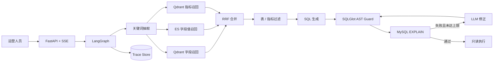

# 系统架构

```mermaid
flowchart LR
    U[运营人员] --> API[FastAPI + SSE]
    API --> G[LangGraph]
    G --> K[关键词抽取]
    K --> C[Qdrant 字段召回]
    K --> V[ES 字段值召回]
    K --> M[Qdrant 指标召回]
    C --> R[RRF 合并]
    V --> R
    M --> R
    R --> F[表 / 指标过滤]
    F --> S[SQL 生成]
    S --> A[SQLGlot AST Guard]
    A --> D[MySQL EXPLAIN]
    D -->|失败且未达上限| X[LLM 修正]
    X --> A
    D -->|通过| Q[只读执行]
    G --> T[(Trace Store)]
```

State 只保存可序列化业务数据，数据库、Qdrant、ES 和 Embedding 客户端通过 LangGraph Runtime Context 注入。召回分数不直接相加，而使用 RRF 统一不同通道的量纲。SQL 在访问数据库前先经过静态安全策略，再通过 `EXPLAIN` 验证真实方言和表结构。
